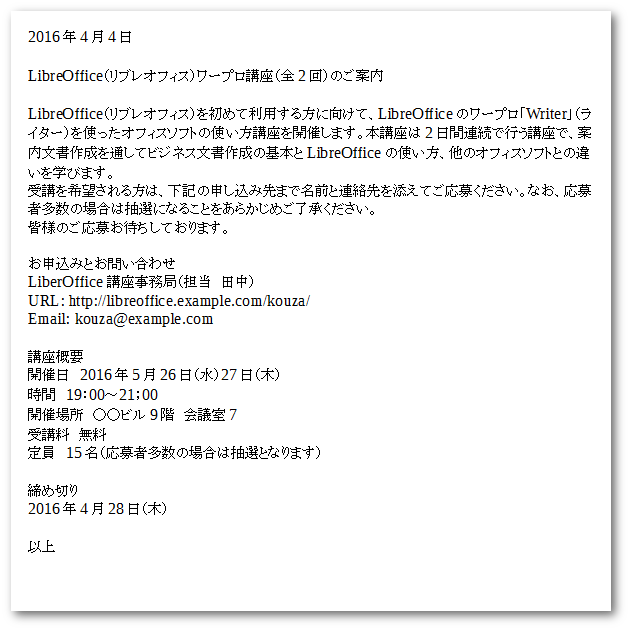
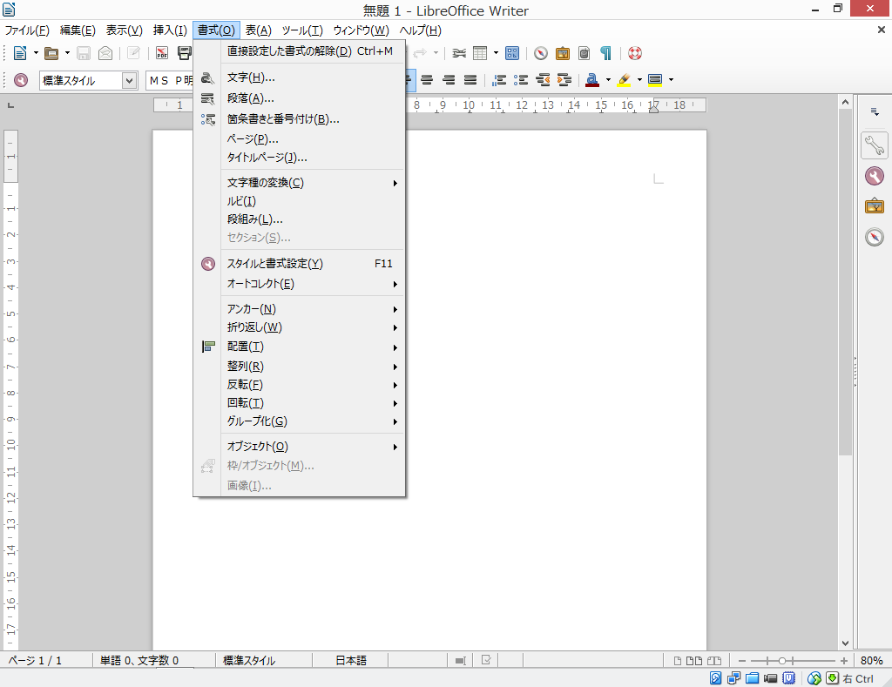

# 基本的な使い方を知ろう


- 案内文書を作成して文字の入力と編集を学ぶ。


## 例題

以下のテキストを入力して、「講座の案内」文書を作成しましょう。

\

## 用紙サイズや余白を設定する

文書の作成の前に、用紙サイズや余白の設定をしましょう。用紙サイズや余白を設定するには、[ページ]を設定します。

\

メニューバー[書式]-[ページ]をクリックします。

\

ページスタイルダイアログが開くので、[ページ]タブをクリックします。
ページの設定は用紙サイズを「A4」、余白は広めに上を3.5cm、下と左右を3.0cmに設定します。

|  | 余白 |
| -- | -- |
| 左 | 3.0cm |
| 右 | 3.0cm |
| 上 | 3.5cm |
| 下 | 3.0cm |

余白の設定で注意。余白の順番は上下左右ではなく、**左右上下**となっています。

## 文章を入力する

それでは文章を入力していきましょう。以下の例文を入力します。

### 例文

```text
2016年4月4日

LibreOffice（リブレオフィス）ワープロ講座（全2回）のご案内

LibreOffice（リブレオフィス）を初めて利用する方に向けて、LibreOfficeのワープロ「Writer」（ライター）を使ったオフィスソフトの使い方講座を開催します。本講座は2日間連続で行う講座で、案内文書作成を通してビジネス文書作成の基本とLibreOfficeの使い方、他のオフィスソフトとの違いを学びます。
受講を希望される方は、下記の申し込み先まで名前と連絡先を添えてご応募ください。なお、応募者多数の場合は抽選になることをあらかじめご了承ください。
皆様のご応募お待ちしております。

お申込みとお問い合わせ
LiberOffice講座事務局（担当　田中）
URL: http://libreoffice.example.com/kouza/
Email: kouza@example.com

講座概要
開催日　2016年5月26日（水）27日（木）
時間　19：00～21；00
開催場所　○○ビル9階　会議室7
受講料　無料
定員　15名（応募者多数の場合は抽選となります）

締め切り
2016年4月28日（木）

以上

```

## 文書の編集

入力した文章を利用して、編集してみましょう。

### 文字列の選択

文字列を選択するには、マウスを使って選択したい文字列をドラッグします。


複数の範囲を選択するときは、Ctrlキーを押しながら、


## クリックによる文字列選択


| クリック回数 | 選択範囲|
| -- | -- |
| ダブルクリック | 単語 |
| 3重クリック | 文（句点「。」まで） |
| 4重クリック | 段落 |


