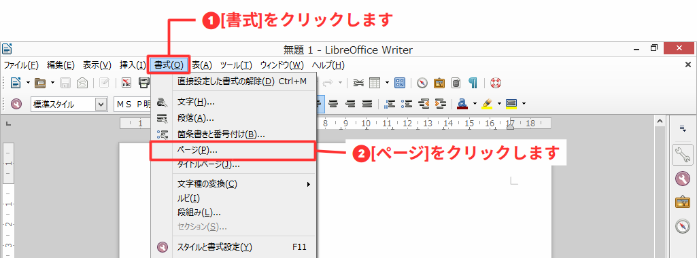
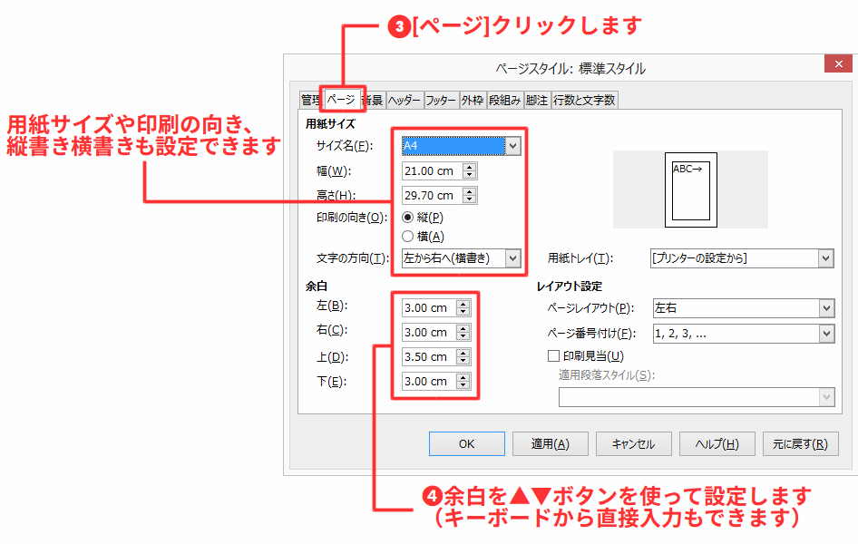

# 基本的な使い方を知ろう

- 文字の入力
- 文字列の編集(切り取り・コピー・貼り付け)

## 例題

以下のテキストを入力して、「講座の案内」文書を作成しましょう。

## 標準ページスタイルを設定する

文書を作成する前に、文書の用紙サイズや余白といったページレイアウトの基本となる、標準ページスタイルを設定します。

メニューバー[書式]-[ページ]を選択します。

ページスタイルダイアログが開くので、[ページ]タブをクリックします。

初期状態では、用紙サイズが「A4」、余白は上下左右それぞれ「2.0cm」になっています。
これの余白を広めの上を「3.5cm」、下と左右を3.0cmに変更します。

| 余白の設定で注意 |
| ---------------- |
| 余白の順番は上下左右ではなく、**左右上下**となっています。|

## 文章を入力する

それでは文章を入力していきましょう。以下の例文を入力しましょう。

### 例文

    2016年4月4日
    
    LibreOffice（リブレオフィス）ワープロ講座（全2回）のご案内
    
    LibreOffice（リブレオフィス）を初めて利用する方に向けて、LibreOfficeのワープロ「Writer」（ライター）を使ったオフィスソフトの使い方講座を開催します。本講座は2日間連続で行う講座で、案内文書作成を通してビジネス文書作成の基本とLibreOfficeの使い方、他のオフィスソフトとの違いを学びます。
    受講を希望される方は、下記の申し込み先まで名前と連絡先を添えてご応募ください。なお、応募者多数の場合は抽選になることをあらかじめご了承ください。
    皆様のご応募お待ちしております。
    
    お申込みとお問い合わせ
    LiberOffice講座事務局（担当　田中）
    URL: http://libreoffice.example.com/kouza/
    Email: kouza@example.com
    
    講座概要
    開催日　2016年5月26日（水）27日（木）
    時間　19：00～21；00
    開催場所　○○ビル9階　会議室7
    受講料　無料
    定員　15名（応募者多数の場合は抽選となります）
    
    締め切り
    2016年4月28日（木）
    
    以上
    

## 文書の編集

入力した文章を利用して、編集してみましょう。

### 文字列の選択

文字列を選択するには、マウスを使って選択したい文字列をドラッグします。

複数の範囲を選択するときは、Ctrlキーを押しながら、

## クリックによる文字列選択

クリックによる文字列選択を使うと、選択したい範囲を素早く指定することができるので覚えておきましょう。

| クリック回数   | 選択範囲             |
| -------------- | ------------------- |
| ダブルクリック | 単語                 |
| 3重クリック    | 文（句点「。」まで） |
| 4重クリック    | 段落                 |

| 選択モード   | 効果                                                                            |
| ------------ | ------------------------------------------------------------------------------- |
| 標準選択     | 通常の選択。ドラッグすると選択され、選択後、クリックすると選択範囲を解除できる。|
| 拡張選択     | クリックした場所を起点に選択範囲を広げたり縮めたりできる。                      |
| 追加選択     | 選択範囲を解除せず。離れた場所も追加して選択できる。                            |
| ブロック選択 | 範囲矩形で選択できる。                                                          |

