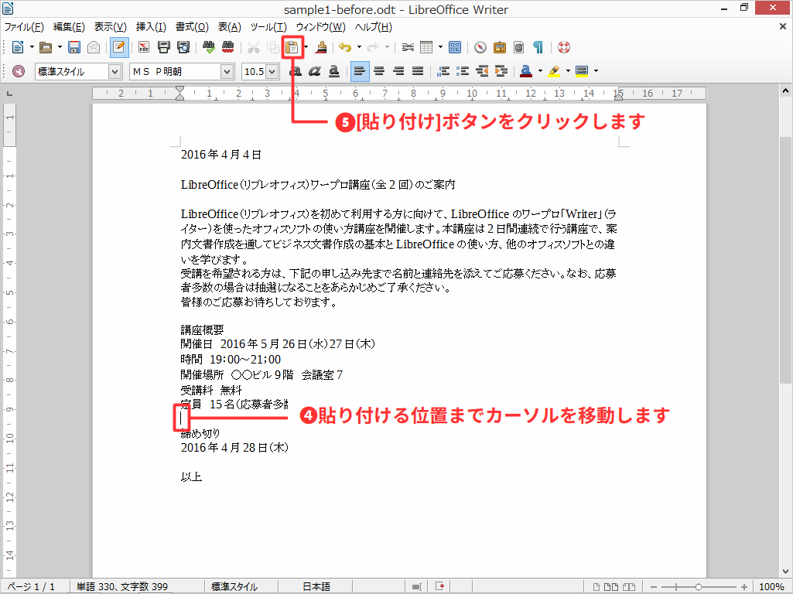

# 基本的な使い方を知ろう

簡単な文書を作成して、Writerの基本操作を学びましょう。

- 文字の入力
- 文書の保存
- 文字列の移動、コピー、貼り付け
- 操作を元に戻す・やり直す

----

# 例題

以下のテキストを入力して、「講座の案内」文書を作成しましょう。


----

# ページスタイルを設定する

文書を作成する前に、文書の用紙サイズや余白といったページのレイアウトを設定しましょう。

## 用紙サイズと余白を設定する

1. メニューバー[書式]-[ページ]を選択します。
2. ページスタイルダイアログが開くので、[ページ]タブをクリックします。


初期状態では、用紙サイズが「A4」、余白は上下左右それぞれ「2.0cm」になっています。
この設定の余白を、用紙上側を「3.5cm」、下側と左右それぞれを3.0cmに変更しましょう。

| 余白の設定で注意 |
| ---------------- |
| 余白の順番は上下左右ではなく、**左右上下**となっています。|

----

# 文章を入力する

それでは文章を入力していきましょう。以下の例文を入力しましょう。

## 例文

```text
2016年4月4日

LibreOffice（リブレオフィス）ワープロ講座（全2回）のご案内

LibreOffice（リブレオフィス）を初めて利用する方に向けて、LibreOfficeのワープロ「Writer」（ライター）を使ったオフィスソフトの使い方講座を開催します。本講座は2日間連続で行う講座で、案内文書作成を通してビジネス文書作成の基本とLibreOfficeの使い方、他のオフィスソフトとの違いを学びます。
受講を希望される方は、下記の申し込み先まで名前と連絡先を添えてご応募ください。なお、応募者多数の場合は抽選になることをあらかじめご了承ください。
皆様のご応募お待ちしております。

お申込みとお問い合わせ
LiberOffice講座事務局（担当　田中）
URL: http://libreoffice.example.com/kouza/
Email: kouza@example.com

講座概要
開催日　2016年5月26日（水）27日（木）
時間　19：00～21；00
開催場所　○○ビル9階　会議室7
受講料　無料
定員　15名（応募者多数の場合は抽選となります）

締め切り
2016年4月28日（木）


以上
```

----

# 文書を保存する

文章の入力が終われば文書を保存します。

1. 文書を保存するには、ツールバー[保存]アイコンをクリックします。
(メニューバー[ファイル]-[名前をつけて保存]でもかまいません。)
2. ファイルダイアログが開くので、ファイルの保存場所とファイル名を入力して「保存」ボタンを押します。


文書は、LibreOfficeの標準ファイル形式であるオープンドキュメント形式で保存されます。

----

# 文章を編集する

入力した文章を利用して、文字列の移動やコピーといった文章を編集しましょう。

## 文字列を移動する

入力した文章の「お申し込みとお問い合わせ」部分を、「講座概要」と「締め切り」の間に移動させましょう。

文章の文字列を編集するには、編集したい文字列の範囲をマウスでドラッグして選択します。

1. カーソルを選択したい文字列の先頭(「お申し込みとお問い合わせ」前の行)まで移動します。
2. マウスをドラッグすると選択部分が水色に変わるので、必要な部分(Email:kouza@example.comの下の行)まで移動して選択します。
3. ツールバー[切り取り]ボタンをクリックします。


カーソルを貼り付ける位置(定員15名と締め切りの間の表)まで移動させ、ツールバー[貼り付け]ボタンをクリックします。



「講座概要」と「締め切り」の間に「お申し込みとお問い合わせ」が挿入されました。


----

## さまざまな文字列の選択方法 (コラム)

文字列の選択は、選択範囲をドラッグする以外にも方法があり、覚えておくと効率よく作業ができるので、どのような方法があるか見ておきましょう。

### 離れた複数の場所を選択する

離れた複数の場所を選択するには、Ctrlキーを押しながら選択したい範囲をドラッグします。

### クリックによる文字列の選択

文字列をクリックして選択範囲の指定もできます。
選択される範囲はクリック回数により異なります。

| クリック回数   | 選択範囲             |
| -------------- | ------------------- |
| ダブルクリック | 単語                 |
| 3重クリック    | 文（句点「。」まで） |
| 4重クリック    | 段落                 |

ダブルクリックによる単語の選択


3重クリックによる文の選択


4重クリックによる段落の選択


### 選択モードの切り替え

文字列の選択方法は、ステータスバーにある選択モードの切り替えで変更できます。


| 選択モード   | 効果                                                                            |
| ------------ | ------------------------------------------------------------------------------- |
| 標準選択     | 通常の選択。ドラッグすると選択され、選択後、クリックすると選択範囲を解除できる。|
| 拡張選択     | クリックした場所を起点に選択範囲を広げたり縮めたりできる。                      |
| 追加選択     | 選択範囲を解除せず離れた場所も追加選択できる。Ctrlキーを押しながら選択と同じ。   |
| ブロック選択 | 行ではなく矩形で選択できる。                                                   |

----

## 文字列をコピーする

「講座概要」にある「受講料 無料」の文字列をコピーして、タイトルの「ワープロ講座ご案内」下に貼り付けてみましょう。

1. 「受講料 無料」の部分をドラッグして選択。ツールバー[コピー]ボタンをクリックします。


2. カーソルをコピーする位置(タイトル「ワープロ講座ご案内」の下)まで移動させ、ツールバー[コピー]ボタンをクリックします。


3. 「ワープロ講座ご案内」の下に「受講料 無料」の文字がコピーされました。


----

# 操作を元に戻す・やり直す

操作を間違えた場合、操作を戻したり、戻しすぎた操作をやり直すことができます。


## 操作を元に戻す

貼り付けた文字列の操作を戻してみましょう。

1. ツールバー[元に戻す]ボタンをクリックします。
2. コピーされた「受講料 無料」の文字列が消えて、コピー前の状態に戻りました。
3. [元に戻す]ボタン2回クリックすると「お申し込みとお問い合わせ」を移動させる前まで戻りました。

## 操作をやり直す

元に戻した操作をやり直して、「お申し込みとお問い合わせ」を移動した状態にしてみましょう。

1. ツールバー[やり直す]ボタンをクリックします。「お申し込みとお問い合わせ」の部分が切り取られた状態にやり直されました。
2. もう一度[やり直す]ボタンをクリックします。
3. 「講座概要」と「締め切り」の間に「お申し込みとお問い合わせ」が入っている状態になりました。

### まとめて元に戻す・やり直す(コラム)

「元に戻す」「やり直す」ボタンの「▼」を押すと、一度に元に戻したり、やり直す事ができます。
