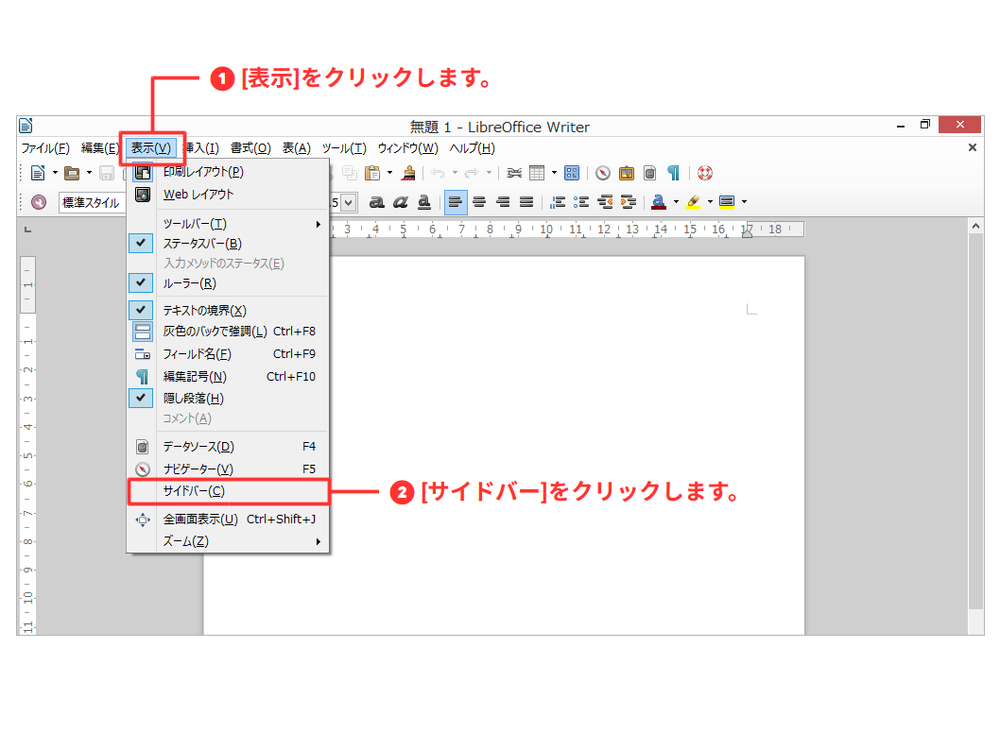
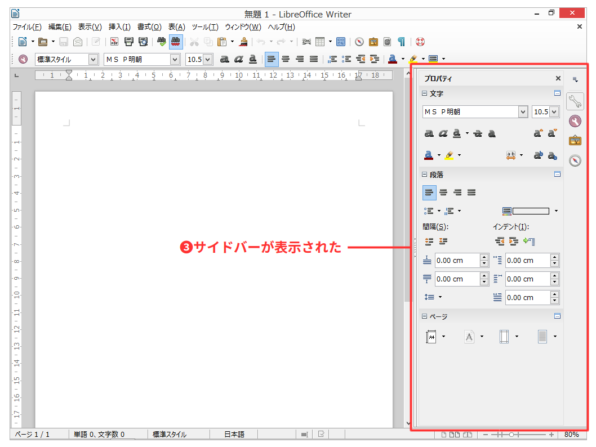

# 文書作成の環境を整える

- 設定を変更して使いやすい環境にする

----

Writerの初期状態で有効となっている機能の中には、オフィスソフトに慣れていない場合、有効になっていると逆にわずらわしく感じる機能があります。

日本語環境ではあまり必要としない機能や、

文章の入力の前に、それらの設定を確認しておきましょう。

## サイドバーを表示する

サイドバーは、初期状態では表示されませんが、ワイド画面のモニターを利用している場合は、すばやく機能にアクセスできるので、とても便利です。また、不要な場合は閉じるなど必要に応じて表示と非表示を切り替えられます。

\

\

## 編集記号を表示する

文字を入力するとき、入力したスペースやエンター、タブといった編集記号は表示されません。

## テキストの変更を止める: オートコレクト機能を無効にする

URLやメールアドレスなどを入力すると自動的にハイパーリンクが張られたり、

あらかじめ設定してある入力規則にのっとって自動的に変更をおこなう「オートコレクト」機能が有効になっています。

## 赤い波線を消す: 自動スペルチェック機能を無効にする

初期状態では、

日本語の辞書がないので

