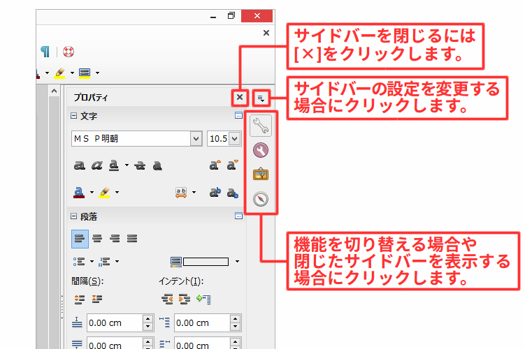

# 文書作成の環境を整える

- 設定を変更して使いやすい環境にする

----

LibreOfficeの初期状態では、

オフィスソフトに慣れていない人にとっては

好みにあった設定に変更して、使いやすい環境に整えましょう。

## サイドバーを表示する

サイドバーは、初期状態では表示されませんが、ワイド画面のモニターを利用している場合は、すばやく機能にアクセスできるので、とても便利です。また、不要な場合は閉じるなど必要に応じて表示と非表示を切り替えられます。

\

\

\

## 編集記号を表示する

編集記号は、スペースやタブといった編集に利用される記号で

スペースや改行・改段落、タブなど文書編集のために位置を制御に編集に利用される記号です。これらの記号は、通常は見えませんが、文書の編集をおこなうときには表示させておくと

## テキストの変更を止める: オートコレクト機能を無効にする

URLやメールアドレスなどを入力すると自動的にハイパーリンクが張られたり、

あらかじめ設定してある入力規則にのっとって自動的に変更をおこなう「オートコレクト」機能が有効になっています。

## 赤い波線を消す: 自動スペルチェック機能を無効にする

初期状態では、スペルチェック機能

日本語の辞書がないので

[スペルと文法チェック]

