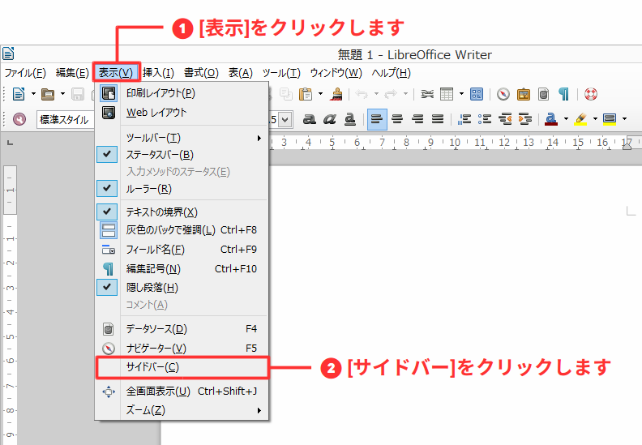
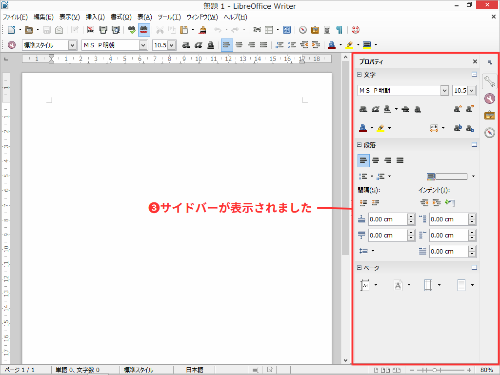
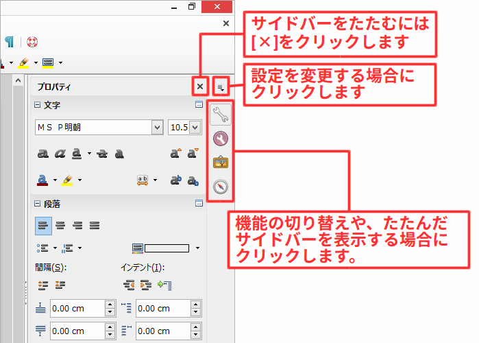

# 文書作成の環境を整える

文書の作成を始める前に設定を変更して、文書作成をしやすい環境を整えましょう。

- 設定を変更して使いやすい環境にする
  - サイドバーを表示する
  - 編集記号を表示する
  - オートコレクト機能
  - 自動スペルチェック機能

----

## サイドバーを表示する

サイドバーは、画面右側に詳細な機能を表示します。初期状態では無効にされていますが、有効にすると機能にすばやくアクセスできるようになり、作業効率も上がるので表示させておきましょう。

また、サイドバーは画面の余白部分に表示するので、ワイド画面モニターを利用している場合は画面を有効活用できます。

### サイドバーについて

サイドバー右側のアイコンは上から順に表のような機能を持っています。

| 名称             | 機能                                              |
|------------------|---------------------------------------------------|
|プロパティ         | 機能の詳細な設定が表示されます                      |
|書式とスタイル設定 | スタイルを管理する「書式とスタイル」を表示されます   |
|ギャラリー         | クリップアートを管理する「ギャラリー」を表示されます |
|ナビゲーター       | 文書内で移動するための「ナビゲーター」を表示されます |

「☓」ボタンを押すとサイドバーを一時的にたためます。画面を広く利用したい場合に有効です。

「三」ボタンからは、サイドバーの設定が変更できます。サイドバーに表示する機能の種類変更やサイドバーを分離して左側に移動といったことが設定できます。

サイドバーを完全に非表示する場合は、もう一度、メニューバー[表示]-[サイドバー]を選択すると非表示に戻ります。

----

## 「¶」や「→」を表示。または消す: 編集記号の表示・非表示

「¶」や「→」などの記号は「編集記号」と呼ばれる記号で、文字の位置などを制御するために使われます。
これらの記号は文章を編集するときに表示させておくと、どの編集記号を使って文字の位置合わせをしているのかが一目で分かるようになります。

初期状態では編集記号は非表示ですが、場合によっては表示させたほうがわかりやすくなるので状況に応じて切り替えましょう。

編集記号の表示、非表示は、ツールバー[編集記号]ボタンをクリックするたびに切り替わります。

----

## テキストの自動変更を止めたい: オートコレクト機能

メールアドレスやURLなどの英文を入力すると、ハイパーリンクが自動的に張られたり、アルファベットの頭文字が大文字になることがあります。
これは、あらかじめ設定してある入力規則から文章を自動的に訂正・変更をおこなう「オートコレクト」機能が働いているためにおこります。

オートコレクト機能は、使いこなせば便利な機能ですが、機能を把握できていない状態ではわずらわしく感じることもあるので必要に応じて切り替えましょう。

入力中のオートコレクト機能を止めるには、メニューバー[書式]-[オートコレクト]-[入力時]を選択して無効にします。

オートコレクト機能によりテキストが自動変更された場合、直後ではツールバー[元に戻す]ボタン(またはCtrl+Z)を使うと変更前に戻せます。

特定の変更だけを無効にしたい。または機能を完全に無効にするには、同じ[オートコレクト]にある[オートコレクトオプション]から変換オプションを変更します。

----

## 赤い波線を消したい: 自動スペルチェック機能

英文を入力したとき、テキストの下に赤い波線が引かれることがあります。
これは「自動スペルチェック」機能により、LibreOfficeの辞書にない単語ということを表しています。

これも便利な機能ですが、文章を入力しているときに表示されると目障りに感じる事もあるので、そういった場合には無効にすると表示を止めることができます。

自動スペルチェックを止めるには、ツールバー[自動スペルチェック]ボタンを押して無効にします。

自動でチェックをせず後からまとめてスペルチェックをするには、その隣にある[スペルと文法チェック]ボタンを押すと、ダイアログから対話的にスペルミスの修正ができます。
